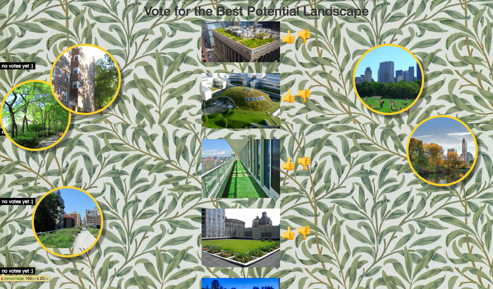

## Team

* Layla - Project Manager
* Lisette - Developer 
* Maya - Developer
* Rosanique - Designer
* Syndra - Designer
* Tasnim - Designer

## What does the project do?
This project helps people in New York help the enviornment by volunteering and  creating their own landscape.
Also, people can donate money.

## Why are you passionate about this idea?
we are passionate about this idea because due to deforestation and pollution, our enviornmet needs help by everyone 
to help.

## How did you build this idea?
we built this idea by 

## How does it work?

## Who would use this project and why?

## What were challenges you ran into and why?

## What did you learn today?

## What would you add if you had more time and why?

Collection of image ideas
* http://www.arch2o.com/wp-content/uploads/2015/12/Arch2O-Urban-green-space-02.jpg
* http://www.adjacentopenaccess.org/wp-content/uploads/2014/01/dreamstime_m_27241130-504x304.jpg
* http://res.cloudinary.com/jpress/image/fetch/w_700,f_auto,ar_3:2,c_fill/http://www.blackpoolgazette.co.uk/webimage/1.8514191.1493288301!/image/image.jpg